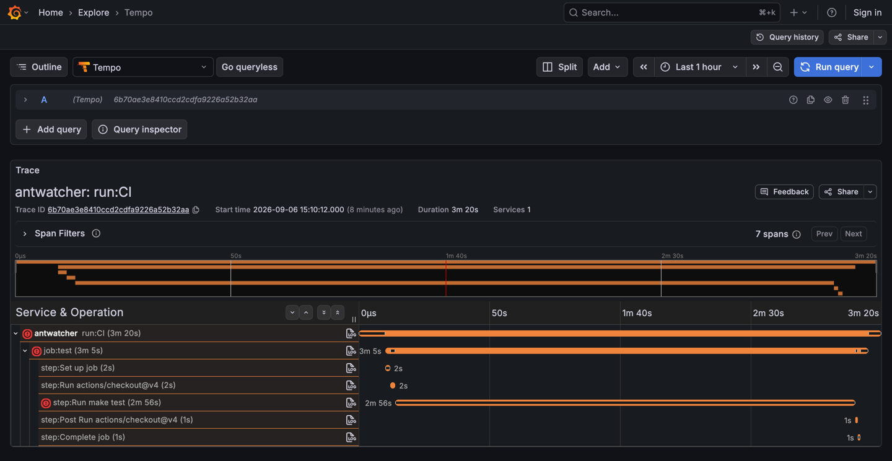
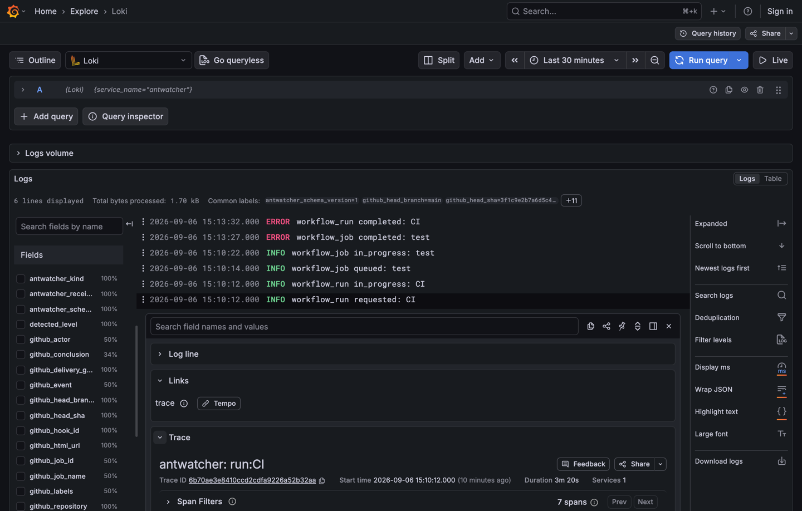

# antwatcher

[](https://github.com/sokogen/antwatcher/actions/workflows/ci.yml)

antwatcher turns GitHub Actions webhooks into traces, logs, analytics rows, archives and
forwarded events, without losing events across destination outages, restarts or short
receiver outages.

GitHub keeps a workflow run behind a UI and a REST API you have to poll, and its webhook
deliveries are replayable for three days. antwatcher takes each delivery as it arrives,
stores it on a durable bus before answering GitHub, and lets every destination consume that
bus at its own pace. Your CI history then lives in the tools you already run: a span tree
per run in Tempo or Jaeger, correlated records in Loki, sparse rows in BigQuery, the raw
JSON on disk.

> **Webhooks are the source of truth. The bus provides durability and replay. The GitHub
> deliveries API repairs missed ingress. Destinations consume independently.**

One Go binary, one YAML file. The Actions REST API is never used to reconstruct runs, jobs
or steps.

## What you get

Each sink is one named consumer of the bus, configured by class and driver:

| Class | What it emits | Drivers | Destination |
|---|---|---|---|
| `trace` | One span tree per workflow run | `otlp` | Any OTLP trace receiver: Tempo, Jaeger, an OpenTelemetry collector |
| `log` | One record per delivery, correlated with the trace | `stdout`, `otlp` | Process stdout, or any OTLP log receiver such as Loki behind a collector |
| `analytics` | Sparse run, job and step rows | `bigquery` | A BigQuery table through the Storage Write API, plus a `_current` view |
| `archive` | The raw envelope and payload, one JSON line each | `filesystem` | A dated directory tree, fsynced before ack |
| `forward` | The raw event, re-published with hop markers | `bus` | Another bus topic, for a downstream consumer |

And the properties that make it worth putting in front of a webhook:

- **Nothing is dropped.** GitHub only sees a `2xx` after the delivery is durably stored.
  A destination that is down accumulates a backlog and catches up; a message it can never
  accept is recorded as stalled and re-attempted, not discarded.
- **Sinks are independent.** Each has its own durable position, its own lag, its own
  failures. A broken BigQuery credential does not stop the traces.
- **Redelivery is safe.** IDs are derived deterministically from GitHub identifiers, so
  replaying an event overwrites rather than duplicates.
- **Missed ingress repairs itself.** Optional recovery scans the GitHub deliveries API and
  asks GitHub to redeliver every GUID that never got a `2xx`.
- **The limits are stated.** Bus retention is the outage budget, history older than it is
  gone, and ingress older than GitHub's three-day window is lost. The full table is in
  [operations](docs/operations.md#failure-behaviour).

## What it looks like

One run as a span tree in Tempo — the run, its job and every step, with the step that failed
carrying the error:



The six deliveries behind that run as records in Loki, each carrying the trace ID, so a
record links straight back to the span tree:



Both are `docker-compose.example.yml`, which runs antwatcher next to an OpenTelemetry
collector, Tempo, Loki and Grafana — see [Docker](#docker).

## Install

Every tagged release publishes a multi-architecture container image and static binaries:

```sh
docker pull ghcr.io/sokogen/antwatcher:latest   # or a version tag, e.g. v0.1.0
```

Binaries for linux and darwin on amd64 and arm64 are attached to each
[release](https://github.com/sokogen/antwatcher/releases) as
`antwatcher_<version>_<os>_<arch>.tar.gz`, each carrying the binary, `README.md`, `LICENSE`
and `antwatcher.example.yml`, with a `checksums.txt` covering all four. Or build from
source, as the quick start does.

## Quick start

The smallest useful deployment: embedded NATS JetStream for durability, one log sink to
stdout, one archive sink to disk. No external services.

1. Build (Go 1.27 or newer):

   ```sh
   make build          # ./bin/antwatcher
   ```

2. Write `antwatcher.yml`:

   ```yaml
   server:
     webhook_secret: ${GITHUB_WEBHOOK_SECRET}
   bus:
     driver: nats-jetstream
     nats-jetstream:
       embedded: true
       store_dir: ./data/nats
   sinks:
     - name: events
       class: log
       driver: stdout
       start_from: now
     - name: raw
       class: archive
       driver: filesystem
       start_from: earliest
       config:
         dir: ./data/archive
   ```

3. Validate and run:

   ```sh
   export GITHUB_WEBHOOK_SECRET='choose-a-long-random-string'
   ./bin/antwatcher serve -config antwatcher.yml -check   # prints the effective config, secrets masked
   ./bin/antwatcher serve -config antwatcher.yml
   ```

4. Send a signed test delivery from another shell:

   ```sh
   body='{"zen":"Keep it logically awesome.","hook_id":1}'
   sig=$(printf '%s' "$body" | openssl dgst -sha256 -hmac "$GITHUB_WEBHOOK_SECRET" | sed 's/^.* //')
   curl -sS -X POST http://localhost:8080/webhook \
     -H 'Content-Type: application/json' \
     -H 'X-GitHub-Event: ping' \
     -H 'X-GitHub-Delivery: 00000000-0000-0000-0000-000000000001' \
     -H "X-Hub-Signature-256: sha256=$sig" \
     -d "$body"
   ```

   A `ping` is acknowledged without being published. Point a real webhook at the receiver
   (see [GitHub webhook setup](docs/configuration.md#github-webhook-setup)) and every
   `workflow_run` and `workflow_job` event appears as a JSON line on stdout and in
   `./data/archive`.

5. Look at the service:

   ```sh
   curl -s http://127.0.0.1:9090/status | jq .
   curl -s http://127.0.0.1:9090/metrics | grep antwatcher_
   ```

To see traces and logs in a UI instead, `docker compose -f docker-compose.example.yml up`
runs the same service next to an OpenTelemetry collector, Tempo, Loki and Grafana. See
[Docker](#docker).

## How it works

The receiver verifies the HMAC, publishes the delivery to the bus, and answers GitHub only
once the bus has acknowledged it. Every message is one webhook delivery: the Watermill UUID
is the GitHub delivery GUID, the metadata carries the envelope (`delivery_guid`, `event`,
`action`, `hook_id`, `received_at`, `repository_id`, `repository`, `schema_version`), and
the payload is the GitHub JSON byte for byte — so the retained log of the bus is the raw
history for its retention window. Each sink subscribes as `sink-<name>`, normalizes the
payload into the projection its class needs, and acks on success or nacks on failure,
leaving every retry to the broker.

```
                 HMAC     publish (durable)      2xx only after PubAck
GitHub ─POST──▶ receiver ───────────────▶ bus ────────────────────────▶ GitHub
                 :8080                    │  topic antwatcher.events
              ┌───────────────────────────┼───────────────────────────┐
              │ consumer sink-tempo       │ consumer sink-bq          │ consumer sink-raw
              ▼                           ▼                           ▼
        ┌───────────┐               ┌───────────┐               ┌───────────┐
        │ Normalize │               │ Normalize │               │  raw env  │
        │  ▼ trace  │               │  ▼ analyt.│               │  ▼ archive│
        │ otlp drv  │               │ bigquery  │               │ filesystem│
        └─────┬─────┘               └─────┬─────┘               └─────┬─────┘
              ▼                           ▼                           ▼
            Tempo                      BigQuery                   ./data/archive

recovery (optional): GitHub deliveries API ──▶ redeliver GUIDs without a 2xx ──▶ receiver
admin :9090: /metrics /status /healthz /readyz
```

The decisions behind this shape are recorded in the ADRs under [`docs/adr`](docs/adr):
[architecture](docs/adr/0001-architecture.md), [bus abstraction](docs/adr/0002-bus-abstraction.md),
[model and classes](docs/adr/0003-model-and-classes.md), [errors and retries](docs/adr/0004-errors-and-retries.md).

## Configuration

antwatcher reads one YAML file: a `server` block, one `bus`, any number of `sinks`, and an
optional `recovery` block. `serve -config antwatcher.yml -check` validates it and prints
the effective configuration with secrets masked.

Every field with its default, the driver matrices, the GitHub webhook setup and the token a
recovery target needs are in the [configuration reference](docs/configuration.md).

The bus underneath is `nats-jetstream`, embedded in the process or external, for anything
that has to survive a restart; `gochannel` is in-process and non-durable, for development
and tests. What each bus guarantees, and what happens when it cannot, is the capability
matrix in the
[configuration reference](docs/configuration.md#bus-drivers-and-capabilities).

## Operations

The admin listener serves `/metrics`, `/status`, `/healthz` and `/readyz`. Those endpoints,
every `antwatcher_` metric, example Prometheus alert rules, the failure-behaviour table,
retention and sizing, and the single-replica notes are in
[operations](docs/operations.md).

Installing, configuring and debugging an instance in someone else's project, by observable
signal, is [agent-operations](docs/agent-operations.md).

## Docker

`Dockerfile` builds a static binary in a multi-stage build and ships it in a distroless
image running as a non-root user. `/data` is a volume for the embedded NATS store and the
filesystem archive; the configuration is read from `/etc/antwatcher/antwatcher.yml` by
default. The build stage runs on the build platform and cross-compiles for the target, so a
multi-platform build never falls back to emulation — which needs BuildKit, the default
builder in current Docker, as the deprecated legacy builder cannot expand `$BUILDPLATFORM`.

```sh
docker pull ghcr.io/sokogen/antwatcher:latest
# or build it yourself:
# docker build -t antwatcher .
# docker buildx build --platform linux/amd64,linux/arm64 -t antwatcher .
docker run --rm -p 8080:8080 -p 127.0.0.1:9090:9090 \
  -e GITHUB_WEBHOOK_SECRET=... \
  -v "$PWD/antwatcher.yml:/etc/antwatcher/antwatcher.yml:ro" \
  -v antwatcher-data:/data \
  ghcr.io/sokogen/antwatcher:latest
```

Set `store_dir` and archive `dir` under `/data` and bind the admin listener to
`0.0.0.0:9090` inside the container; publish it to the host loopback only, as above.

`docker-compose.example.yml` runs antwatcher with embedded NATS next to an OpenTelemetry
collector, Grafana Tempo, Loki, and Grafana with both data sources provisioned. Traces and
logs flow antwatcher → collector → Tempo and Loki; the supporting configuration lives in
`deploy/compose/`.

```sh
export GITHUB_WEBHOOK_SECRET=...
docker compose -f docker-compose.example.yml up --build
# webhook  http://localhost:8080/webhook
# grafana  http://localhost:3000   (anonymous admin, Tempo and Loki data sources)
# status   http://127.0.0.1:9090/status
```

The compose build passes `VERSION`, `COMMIT` and `DATE` through as build arguments, taken
from the environment and falling back to `dev` for the version and `unknown` for the other
two. Export them to stamp the image the way
`make build` stamps a local binary:

```sh
export VERSION=$(git describe --tags --always --dirty) \
       COMMIT=$(git rev-parse --short HEAD) \
       DATE=$(date -u +%Y-%m-%dT%H:%M:%SZ)
```

## Development

```sh
make build      # ./bin/antwatcher
make test       # go test -race -cover ./..., writes coverage.out
make coverage   # per-package 80% gate, reads the profile make test wrote
make lint       # golangci-lint, pinned, installed into ./bin on first use
make readme     # regenerate docs/configuration.md from antwatcher.example.yml
GITHUB_WEBHOOK_SECRET=dummy make check CONFIG=antwatcher.example.yml
```

CI runs exactly these targets, so a green `make lint test coverage` locally is a green CI.
`make check` on the example config needs `GITHUB_WEBHOOK_SECRET` set, because the file
references it.

The test suite needs no network and no external services: unit tests use the in-process
`gochannel` bus, integration tests start an embedded JetStream server in a temporary
directory, and the end-to-end test drives a signed webhook through the receiver, the bus,
and one capturing sink of every class. Architecture rules (no driver imports outside `cmd`,
no Actions REST API, no handler-side retry or sleep, error classification in every driver)
are enforced by tests in `internal/archtest`.

[`AGENTS.md`](AGENTS.md) is the contributor's view: the layout, the conventions, and the
recipes for adding a bus or a sink driver.

## Licence

MIT — see [`LICENSE`](LICENSE). Copyright (c) 2026 Gennady Sokolachko.
